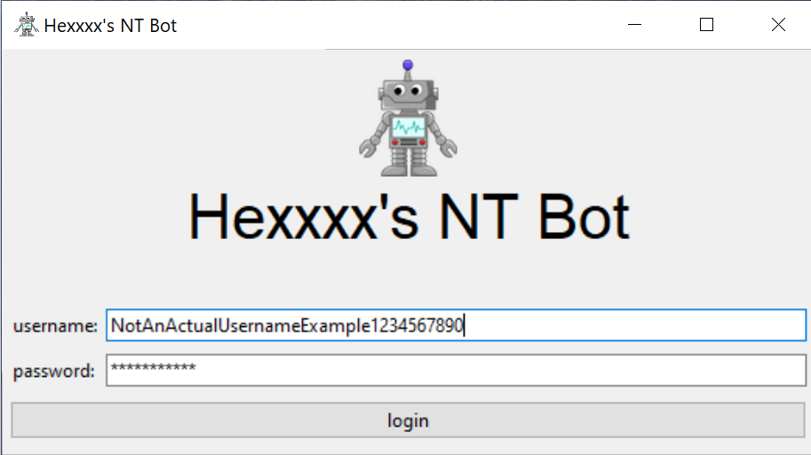
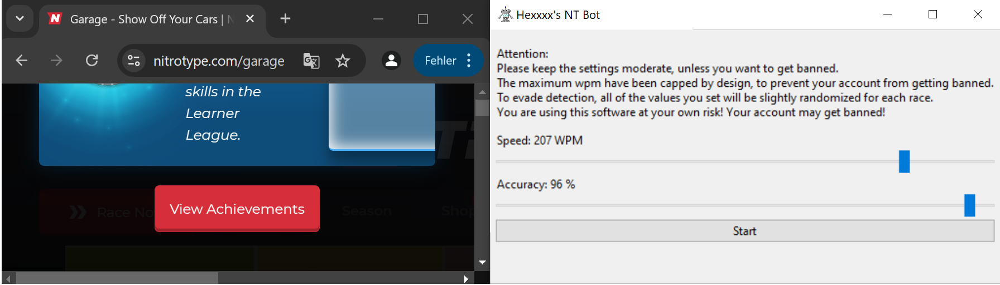
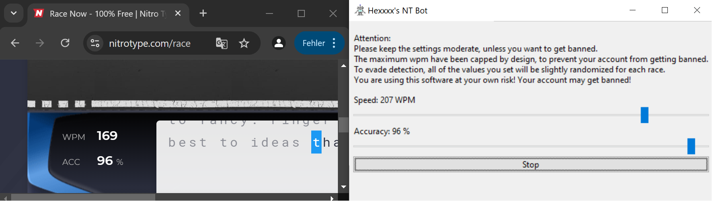

# Hexxxx's NT Bot
Hexxxx's NT Bot is a simple Nitro Type bot written in Python, using selenium and chromedriver. Brought to you by impeccable distaste towards the ongoing neglegence of the NT development team and insufficient anti-cheat measures. A project to test NT's bot detection, will probably be abused for cheating, but there are already better bots written in JavaScript anyways.

## Requirements
The following system requirements must be met to run Hexxxx's NT Bot:

- Windows (Linux is possible, but not tested nor built / released.)
- US keyboard layout (required by chromedriver; see installation through Windows language settings)
- Chrome browser
- NitroType account

## Tutorial

### Login
Open the app and enter your NT credentials. Press the login button and wait for the app the process your request.

You may encounter an error, informing you that you need a US keyboard layout. In that case install US english using the Windows language settings and switch between layouts using the key combination "win" + "space".

### Settings
Adjust WPM (words per minute) and accuracy using the sliders. The actual values will be slightly randomized, inaccurate and also heavily impacted by their relation to one another. If you set the accuracy low, the resulting WPM will also be lower when starting the bot.

### Race
Click the start button to start a race. You must wait for the bot to finish the race, until you can start a new one. Races will be looped indefinitely, until you stop the bot using the stop button. In between races (While the bot has not been started.) you are free to take over the browser window and visit shop / garage / team / leage, etc. without any issues.

## Current features
- Automated login
- Automated racing
- randomized wpm & accuracy to evade simple anti-cheat methods

## Planned features
- Automated account creation
- Multiple parallel sessions in same instance
- Better randomization and actual anti-detection strategies
- Headless mode
- Automated testing & less bugs :)

## Not planned / missing features (for now)
- Captcha bypass / human verification
